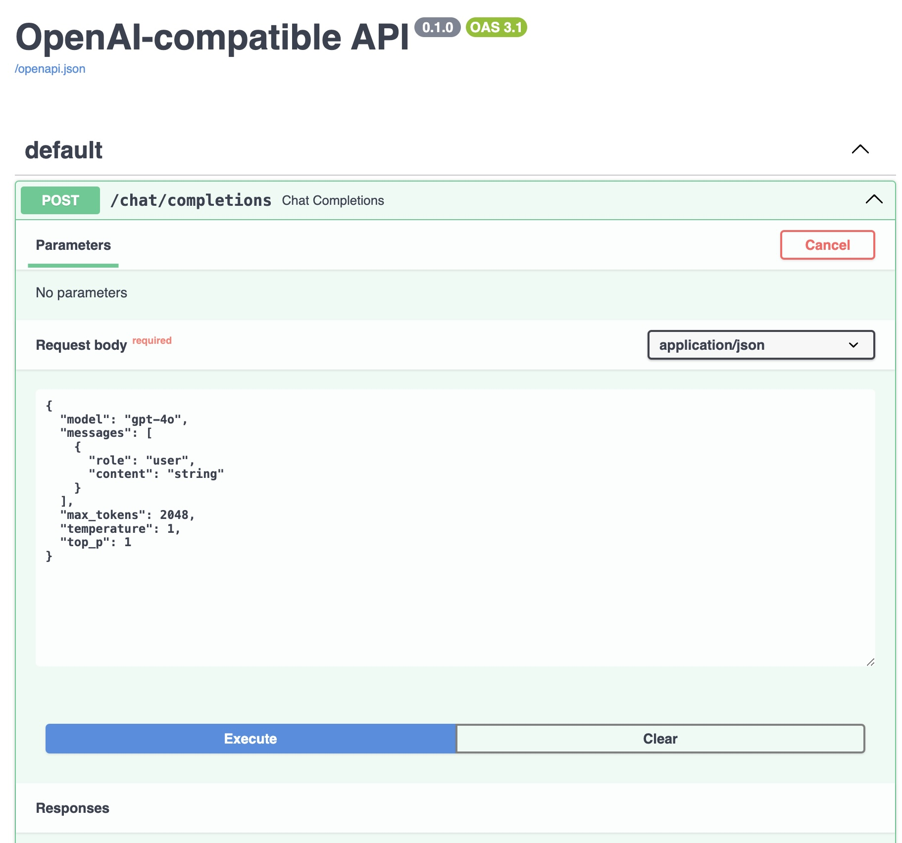

OpenAI Compatible API with full LLM-guard on both input and output

- `input_scanners = [Anonymize(vault), Toxicity(), TokenLimit(), PromptInjection()]`
- `output_scanners = [Deanonymize(vault), NoRefusal(), Relevance(), Sensitive()]`

Mess around with at your discretion

- `uv sync` to install
- have valid `OPENAI_API_KEY` in your env
- `python main.py` to run (will download a lot (few GB) of assets needed by llm-guard)

Can point CLI at this with the following .toml:

```
target = "llm-guarded-model"
model_name="gpt-4o"
preset = "openai-compatible"
url = "http://localhost:8000/v1/chat/completions"
api-key = "blah"
system-prompt = 'You are a helpful LLM assistant!'
```